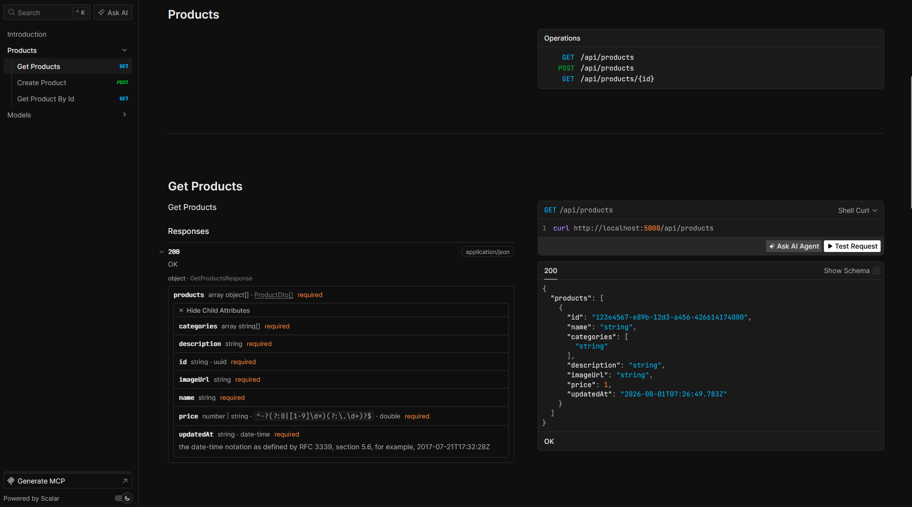

# EShopMicroservice
Microservice, CQRS, Mediator in .NET 

## Services

### [BuildingBlocks](./src/BuildingBlocks/BuildingBlock/)

Common building bocks are kept here like CQRS interfaces.

### [CatalogApi](./src/Services/Catalog/Catalog.API/)

Catalog API service to handle products.



<strong>```PORT:```</strong>

```plaintext
Local Development: 
    http: 5000
    https: 5050
Docker External:
    http: 6000
    https: 6060
Docker Internal:
    http: 8000
    https: 8080
```
